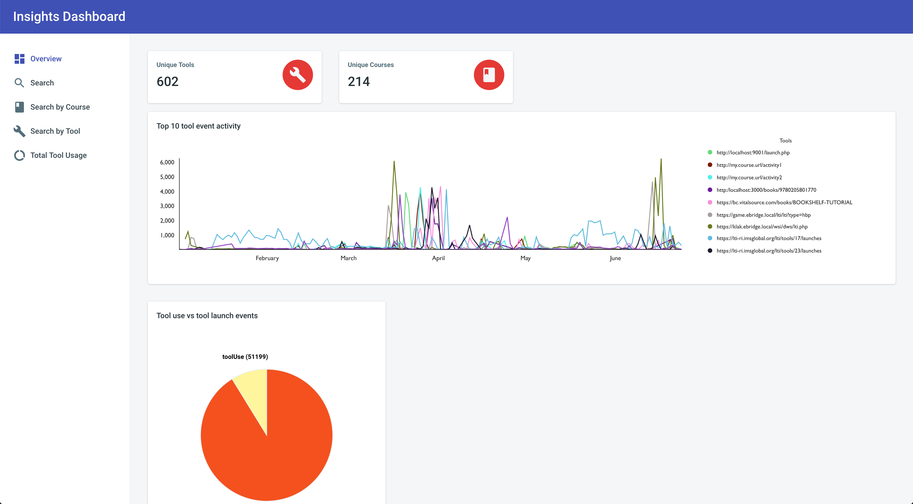

<h1 align="center">Insights Dashboard 📊</h1>

  Visualization Dashboard for LTI Insights

  

---

## 🚩 Requirements

These instructions will get you a copy of the project up and running on your local machine.

### Prerequisites

1. **Install [Node 8.0.0 or greater](https://nodejs.org)**.
2. **Install [Git](https://git-scm.com/downloads)**.

## 🚧 Development

1. First, clone this repo. `git clone https://github.com/patricklinpl/insights-dashboard.git`
2. Then cd into the repo. `cd insights-dashboard`
3. Run the installation script. `npm install` (If you see `babel-node: command not found`, you've missed this step.)
4. Run using `npm start`. Webpack Dev Server will host a hot-loading webpage.

## 👏 Credits 
- [Justin Lee](https://github.com/justin0022) - [dashboard](https://github.com/justin0022/dashboard)
- [Devias](https://github.com/devias-io) - [react-material-dashboard](https://github.com/devias-io/react-material-dashboard)
